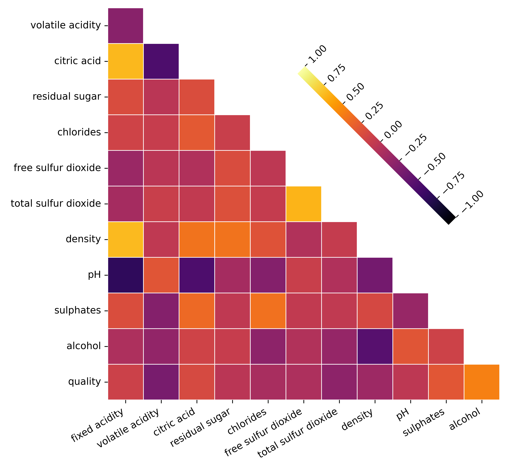
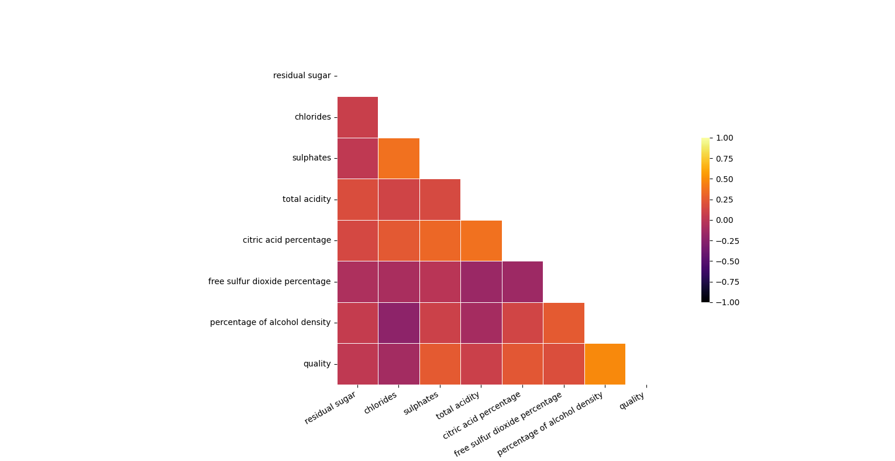
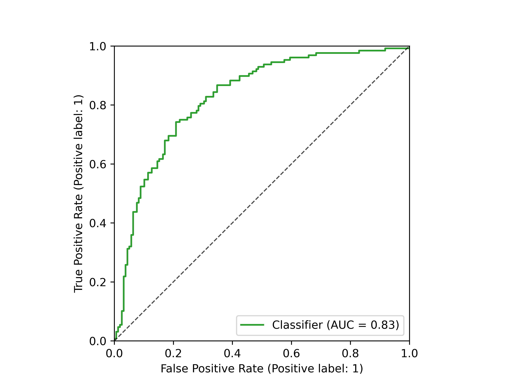
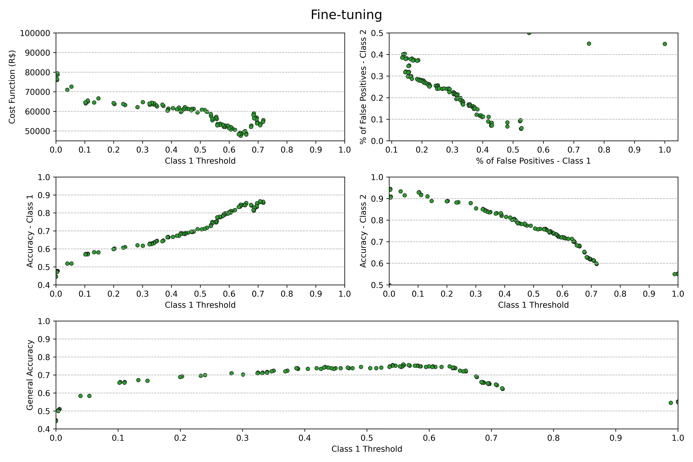

<details open>

<summary><i>Overview of the project</i></summary>

<h2><b>
    Overview of the project
</b></h2>

The correct classification of wine quality is extremely important for producers and distributors, as the sale of incorrectly classified wines can result in refunds to the company. For this reason, I developed a machine learning algorithm that can be customized for different business cases. The overall accuracy of the algorithm was almost 74%, assuming that all wine qualities have the same importance, which is not always the case, because if a merchant sells more wines of a specific quality, it is important that they have better classification performance in that category rather than others, reducing the cost of reimbursement. The customization of the algorithm is explained in the section Testing and fine-tuning the model. 

I used the Wine Quality Database provided by the article “[Modeling wine preferences by data mining from physicochemical properties](https://www.sciencedirect.com/science/article/abs/pii/S0167923609001377?via%3Dihub).” The researchers used the Support Vector Machine (SVM) algorithm to predict wine quality, but did not achieve good results, with an accuracy of approximately 63%. This shows that predicting wine quality is not an easy task, and may be due to the unbalanced distribution of data, as I discuss in the section “Data Manipulation.”

My proposal is to combine some wine qualities into a single category to balance the distribution of data. In addition, a feature engineering and selection process was performed, which eliminated multicollinearity between features, and for the training part, a cross-validation procedure was applied, which provided a good generalization of the best algorithm, suggested by its performance on the test dataset. Finally, business knowledge was applied to further improve the predictions.

Click on “<i>Wine Parameters</i>” for more information about the characteristics of the database.

<details>

<summary><h3><b><i>Wine Parameters</i></b></h3></summary>

<details>
<summary><b>Fixed Acidity (g/L)</b></summary>

<i>Acids are responsible for the “flatness” when there is little acid, or for the sour taste of a wine. The [fixed acids](https://waterhouse.ucdavis.edu/whats-in-wine/fixed-acidity) found in wines are tartaric, malic, citric, and succinic.</i>
</details>

<details>
<summary><b>Volatile Acidity (g/L)</b></summary>

<i>The most common [volatile acid](https://www.awri.com.au/wp-content/uploads/2018/03/s1982.pdf) is acetic acid, which is responsible for the smell of wine due to evaporation. In addition, sulfuric acid is also a volatile acid.</i>
</details>

<details>
<summary><b>Citric Acid (g/L)</b></summary>

<i>It is a [fixed acid](https://waterhouse.ucdavis.edu/whats-in-wine/fixed-acidity) found in the range of 0 to 0.5 g/L.</i>
</details>

<details>
<summary><b>Residual Sugar (g/L)</b></summary>

<i>It is the [natural sugar](https://winefolly.com/deep-dive/what-is-residual-sugar-in-wine/) from grapes that remains in wine after the fermentation process has been interrupted. Its quantity determines the sweetness of the wine..</i>
</details>

<details>
<summary><b>Chlorides (g/L)</b></summary>

<i>This influences the “flatness” and persistence of the flavor. Grapes grown in regions close to the sea tend to produce juice with a higher [chloride content](https://www.awri.com.au/wp-content/uploads/2018/08/s1530.pdf).</i>
</details>

<details>
<summary><b>Sulphates (g/L)</b></summary>

<i>Sulphates are responsible for [antioxidant and antimicrobial activity](https://www.lasommeliere.com/en/blog/sulfites-in-wine-what-are-they-and-what-do-they-do--n520), acting as preservatives for wines.</i>
</details>

<details>
<summary><b>Free Sulfur Dioxide (mg/L)</b></summary>

<i>Like sulfates, [free sulfur dioxide](https://extension.okstate.edu/fact-sheets/understanding-free-sulfur-dioxide-fso2-in-wine.html) acts as a preservative in wine. It tends to bind to other molecules, losing its preservative action.</i>
</details>

<details>
<summary><b>Total Sulfur Dioxide (mg/L)</b></summary>

<i>Basically, it is the [sum of free sulfur dioxide and bound sulfur dioxide](https://www.oiv.int/public/medias/7840/oiv-collective-expertise-document-so2-and-wine-a-review.pdf).</i>
</details>

<details>
<summary><b>Density (g/mL)</b></summary>

<i>It is an important parameter for monitoring the fermentation process. Once stabilized, it can be related to the smoothness of the wine.</i>
</details>

<details>
<summary><b>pH</b></summary>

<i>It is a [measure of the acidity of wine](https://www.awri.com.au/industry_support/winemaking_resources/frequently_asked_questions/acidity_and_ph/). A high pH means that there are more free hydrogen ions available to bind with free sulfur dioxide. Therefore, these two parameters must combine to provide the perfect sensation of desired acidity and prevent the wine from deteriorating.</i>
</details>

<details>
<summary><b>Alcohol (%)</b></summary>

<i>It acts as a preservative, but is also responsible for the wine's [burning sensation](https://vinaliawine.com/blogs/our-journal/alcohol-and-its-role-in-wine?srsltid=AfmBOoooYR_PZUzfbiqLh8isStKaKnK6DNTravGMLjqb9kQZBiRmL9m6).</i>
</details>

</details>

</details>

The information about the model development is provided on the following tabs. Just <b>click on it</b> to open the explanation.

<details>

<summary><i><b>Creating an SQL database and connecting Python to the SQL Server database</b></i></summary>

<h2><b>
    Creating an SQL database and connecting Python to the SQL Server database
</b></h2>

To create the SQL database with the wine features, we can run the [code](https://github.com/L-Loreti/Wine-Quality-Classifier/blob/main/src/CREATE_WINE_DATABASE.sql).

With the wine database set up in SQL Server, we can use the <i>mysql</i> library to connect Python to it and obtain the chemical features table:
```python
connection = connector.connect(
  host = '127.0.0.1',
  user = 'Leonardo-Loreti',
  password = '########',
  database = 'WineQT')

query = 'SELECT * FROM WineData'

wine = pd.read_sql(query, con = connection)
```

</details>

<details>

<summary><i><b>Data manipulation</b></i></summary>

<h3><b>Data manipulation</b></h3>

There were no <b>null</b> or <b>duplicated</b> data in the dataframe, as verified with the commands <i>.info()</i> and <i>.duplicated().sum()</i>, but the data is highly unbalanced, as can be seen with the following histogram.

<p align = 'center'>
    
</p>

This leads to a serious overfitting to the classes that have more data.

In addition, some characteristics showed a <b>high pairwise correlation</b>, which can be observed in the correlation matrix graph using <b>Pearson's correlation</b>, and some of them also had a <b>high Variance Inflation Factor (VIF)</b>, which indicates <b>multicollinearity</b> that can affect the accuracy of coefficient estimates and degrade the inferential power of the models.

<table align = 'center'>
<tr>
<th>VIF (desc. order)</th>
<th>Heatmap</th>
</tr>
<tr>
<td>
<pre>
    - constant: 1.7108e6<br>
    - fixed acidity: 7.7845<br>
    - density: 6.5979<br>
    - alcohol: 3.4108<br>
    - pH: 3.4034<br>
    - citric acid: 3.2245<br>
    - total sulfur dioxide: 2.1243<br>
    - free sulfur dioxide: 1.9075<br>
    - volatile acidity: 1.8799<br>
    - residual sugar: 1.7441<br>
    - quality: 1.5981<br>
    - chlorides: 1.5545<br>
    - sulphates: 1.4955<br>
</pre>
</td>
<td>
    
</td>
</tr>
</table>

<h3><b>Feature creation and reclassification of classes</b></h3>

To solve the problem of high VIF and binary correlation between the variables <b>fixed acidity</b>, <b>citric acid</b>, <b>density</b>, <b>alcohol</b>, and <b>total sulfur dioxide</b>, it is possible to create new representative variables:
<ul>
    <li><b>total acidity</b> = fixed acidity + volatile acidity</li>
    <li><b>citric acid percentage</b> = citric acid/total acidity</li>
    <li><b>free sulfur dioxide percentage</b> = free sulfur dioxide/total sulful dioxide</li>
    <li><b>percentage of alcohol density</b> = alcohol/(100*density)</li>
</ul>

Evaluating Pearson's correlation and VIF, we see that multicollinearity and binary correlation have been mitigated and, in fact, the target (quality) is the variable that can best be explained by the other features (the constant only indicates that the features have an important constant component).

<table align = 'center'>
<tr>
<th>VIF (desc. order)</th>
<th>Heatmap</th>
</tr>
<tr>
<td>
<pre>
    - constant: 163.6875<br>
    - quality: 1.4843<br>
    - percentage of alcohol density: 1.4777<br>
    - citric acid percentage: 1.4178<br>
    - sulphates: 1.3602<br>
    - chlorides: 1.3567<br>
    - total acidity: 1.2413<br>
    - free sulfur dioxide percentage: 1.1391<br>
    - residual sugar: 1.0540<br>
</pre>
</td>
<td>
    
</td>
</tr>
</table>

To solve the problem of imbalance in the amount of data for certain classes, I combined wines of quality <b>3</b>, <b>4</b>, and <b>5</b>, forming the quality of <i>intermediate wines</i>, and classes <b>6</b>, <b>7</b>, and <b>8</b> as <i>premium quality</i> wines, as can be seen on the next histogram.

<p align = 'center'>
    
</p>

I also checked the scatter plot of the [features](https://github.com/L-Loreti/Wine-Quality-Classifier/blob/main/figs-results/scatter_plot_withoutTarget_modifiedFeatures.png) to verify that there were no patterns that Pearson's correlation coefficient did not detect, and the scatter plot of the [features with the target](https://github.com/L-Loreti/Wine-Quality-Classifier/blob/main/figs-results/scatter_plot_withTarget_modifiedFeatures.png) to see if I could figure out which feature could best explain the target. Initially, it seems that the “percentage of alcohol density” feature is the only one that shows a pattern in relation to the target. 

</details>

<details>

<summary><i><b>Selection between models</b></i></summary>

<h2><b>Selection between models</b></h2>

I selected four different classification algorithms with slightly different characteristics to check which one works best for our dataset:
1. <b>Logistic regression:</b> it is an <i>easily interpretable linear</i> model;
2. <b>Linear discriminant analysis:</b> it is also <i>linear</i>, but assumes that the features are described by a <i>Gaussian distribution</i> and have the <i>same variance</i>;
3. <b>Quadratic discriminant analysis:</b> also assumes a <i>Gaussian distribution</i>, but <i>not the same covariance</i> matrix, which results in a <i>quadratic boundary threshold</i>;
4. <b>Gaussian Naive Bayes:</b> considers that the data are <i>gaussian</i> and <i>statistically independent</i>.

<h3>Split dataset on training and testing portions</h3>

The test set will contain 25% of the total data. I used a specific seed for the split, maintaining reproducibility.
```python
test_size_ = 0.25
xTrain, xTest, yTrain, yTest = train_test_split(x, y, test_size = test_size_, random_state = 42)
```

<h3><b>Forward feature selection with cross-validation</b></h3>

To choose the best algorithm for the dataset, <b>SequentialFeatureSelector</b> from the <b>sklearn</b> library, to check which features resulted in the best predictions, using the <b>accuracy</b> metric with the <b>cross-validation method</b>, as provided by my function [<b>get_best_features(...) </b>](https://github.com/L-Loreti/Wine-Quality-Classifier/blob/main/src/functions.py).

Once again, to ensure reproducibility of the results, I configured the <b>KFold generator</b> with a specific seed,
```python
n_folds = 10
kf = KFold(n_splits=n_folds, shuffle=True, random_state = 81)
```

I stored the feature names in a .txt file for later training because the <b>SequentialFeatureSelector</b> does not show the predictions themselves.

</details>

<details>

<summary><i><b>Model's Training</b></i></summary>

<h2><b>Model's Training</b></h2>

Using the same seed for the KFold generator, I [trained](https://github.com/L-Loreti/Wine-Quality-Classifier/blob/main/src/model_training.py) the models with the best selected features, checking the accuracy by wine category and the overall accuracy, as shown in the next figure.

<p align = "center">
    
</p>

Cross-validation allows us to visualize the generalization of the model on the training set, through the standard deviation.

Analyzing the graph, we see that the GNB model, with [four features](figs-results/Model_accuracies_different_classes_folds=10.txt), had the best performance. In fact, GNB and LDA performed similarly, indicating that the features exhibit approximately Gaussian behavior, and their variances are not so distinct, which explains the poor performance of QDA.

</details>

<details>

<summary><i><b>Model testing and fine-tuning</b></i></summary>

<h2><b>Model testing and fine-tuning</b></h2>

The chosen algorithm, GNB with four features, was evaluated on the test set. The accuracy by wine category and overall was as follows:
<ul>
    <li><b>Accuracy in Class 1:</b> 70.5%</li>
    <li><b>Accuracy in Class 2:</b> 76.4%</li>
    <li><b>Overall accuracy:</b> 73.8%</li>
</ul>

Thus, the model was saved with the <i>pickle</i> library for later optimization with business knowledge.

```python
    file_model = open('Trained model.pkl', 'wb')
    pickle.dump(model, file_model)
```

<h3><b>Fine-tune with business knowledge</b></h3>

The model is optimized for the general case, in which customers buy the same quantity of wines from both classes. However, there are other relevant parameters that we can introduce, such as the price of wines from different classes (an average) and the quantity of wines from each class purchased by a given group of customers. The <b>overall goal of fine-tuning</b> is to <b>reduce the number of false positives</b>, i.e., erroneous classifications, as this can cause losses to the company in the form of <b>refunds</b> or <b>credit for future transactions</b>.

<h3><b>Bussiness Case</b></h3>

Suppose there is a group of customers with similar purchasing profiles. In a month, they typically buy <b>3000</b> class 1 wines ($q_{1}$) and <b>1000</b> class 2 wines ($q_{2}$). If the average price of class 1 wines ($p_{1}$) is $45.00, and class 2 wines ($p_{2}$) is $90.00, the total revenue is $225,000. With the non-optimized model, we have approximately <b>29.5%</b> false positives for class 1 ($fp_{1}$), and approximately <b>23.6%</b> for class 2 ($fp_{1}$). Considering the following cost function (C):  
<p align = ‘center’>
$$C = fp_{1} \cdot q_{1} \cdot p_{1} + fp_{2} \cdot q_{2} \cdot p_{2}$$
</p>
the loss would be <b>R$ 61,065.00</b>, i.e., <b>27.14%</b> of total revenue.

Fine tuning consists of finding a threshold for the algorithm that minimizes the cost function. To do this, we can use the different thresholds provided by the ROC curve.

<p align = 'center'>
    
</p>

The figure below shows the <b>cost function</b> (<i>top left</i>), the <b>relationship between false positives in classes 1 and 2 with different thresholds</b> (<i>top right</i>), the accuracy of both classes (<i>middle figures</i>), and the overall accuracy for different thresholds (<i>bottom figure</i>).

<p align = 'center'>
    
</p>

Optimizing the cost function, we have:
<ul>
    <li><b>Minimum cost function:</b> R$ 47,596.15, representing 21.1% of total sales</li>
    <li><b>Class 1 accuracy:</b> 84.6%</li>
    <li><b>Class 2 accuracy:</b> 70.2%</li>
    <li><b>Overall accuracy:</b> 74.1%</li>
</ul>

</details>

<details>

<summary><i><b>Next steps</b></i></summary>

<h2><b>Next steps</b></h2>

With bussiness knowledge it is possible to optimize even further the algorithm, for example: 

<ol>
    <li>If it is possible to group customers into specific groups based on their purchasing profile, it is possible to choose a more appropriate threshold, reducing losses;</li>
    <li>Through conversations with stakeholders and the business intelligence team, it is possible to decide to optimize some other parameter, such as <b>general accuracy</b>, and this is easily done in my code;</li>
    <li>To improve the algorithm's resolution, i.e., to be able to classify wines in all their classes, a more in-depth study of the types of data that can be extracted is necessary. In addition to requiring a larger amount for the lower and higher quality classes;</li>
    <li>And as always, the model needs to be continuously verified.</li>
</ol>

</details>
