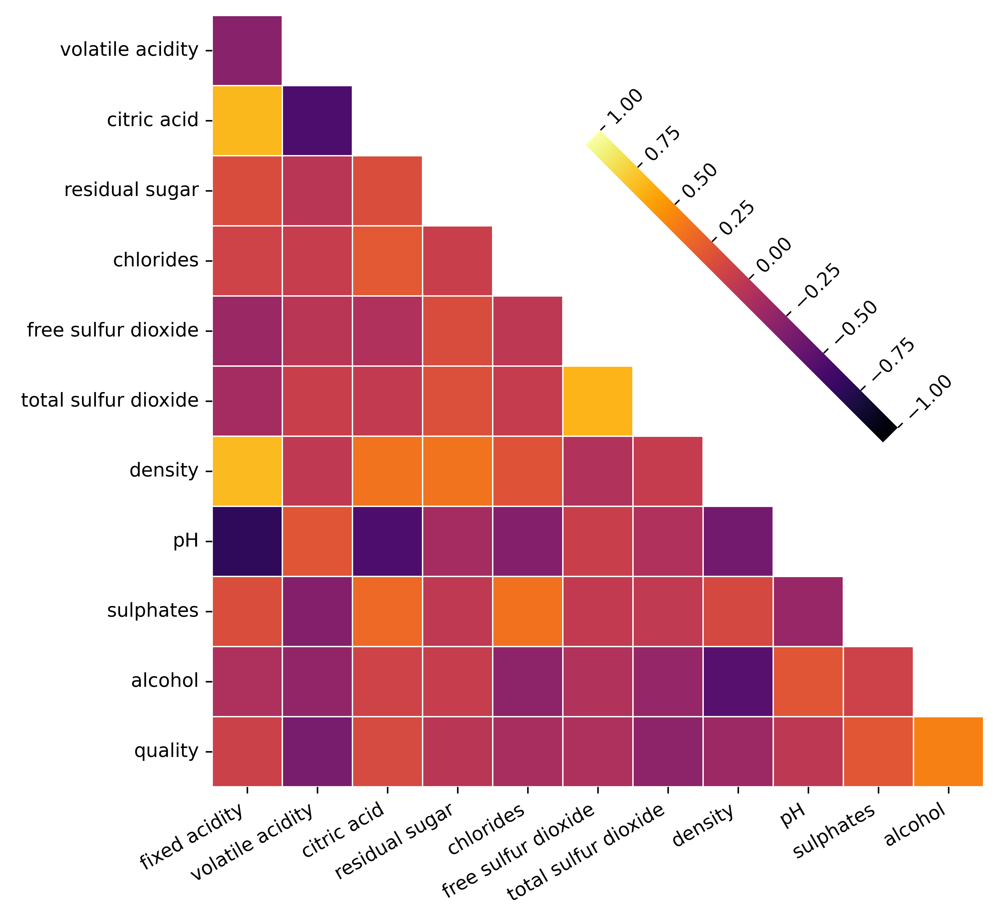
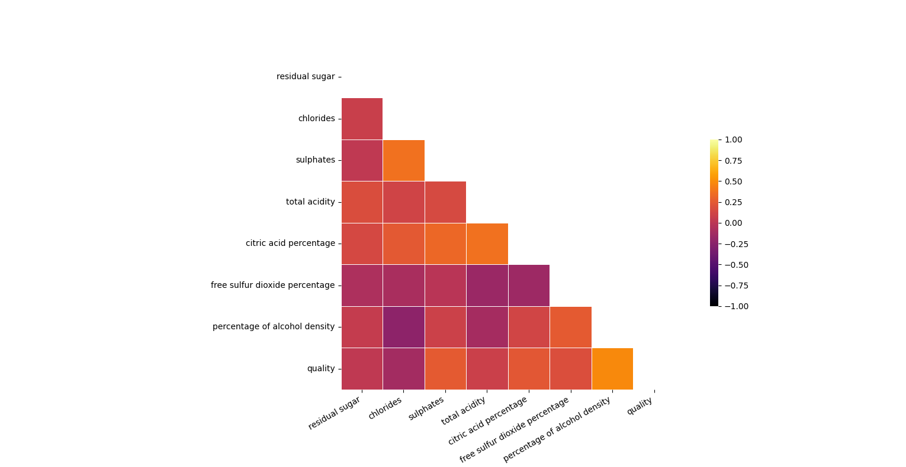
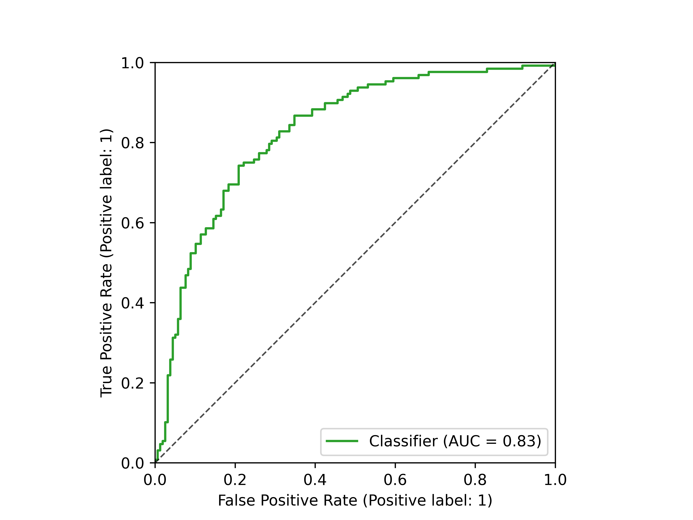
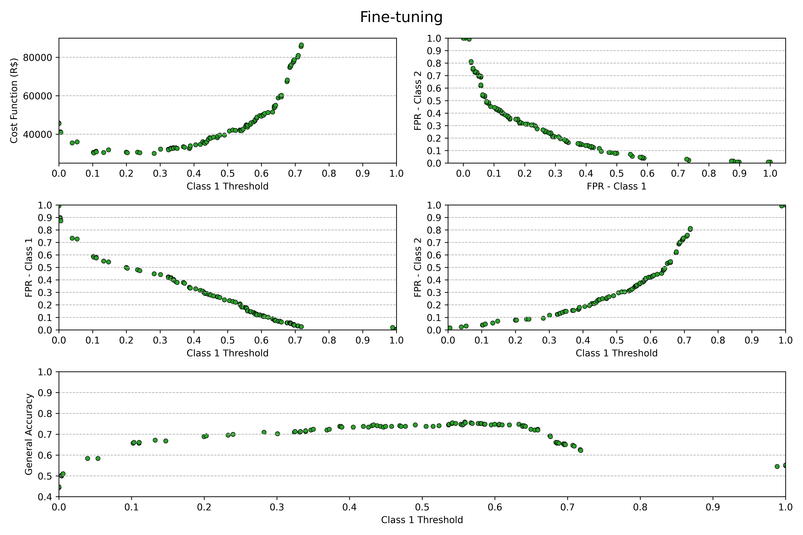

<details open>

<summary><i>Visão geral do projeto</i></summary>

<h2><b>
    Visão geral do projeto
</b></h2>

A classificação correta da qualidade dos vinhos é extremamente importante para produtores e distribuidores, já que a venda de vinhos classificados incorretamente pode resultar em <b>reembolso aos clientes</b>. Por esse motivo, desenvolvi um modelo de aprendizado de máquina personalizável para diferentes casos de negócios. A <b>precisão geral do algoritmo foi de aproximadamente 75%</b>, assumindo que todas as qualidades de vinhos têm a mesma importância, o que nem sempre é o caso, pois se um comerciante vende mais vinhos de uma qualidade específica, é importante que ele tenha um melhor desempenho de classificação nessa categoria, em vez das outras, reduzindo o custo do reembolso. A personalização do algoritmo é explicada na seção teste e ajuste fino do modelo. 

Usei o Banco de Dados de Qualidade do Vinho fornecido pelo artigo “[Modelagem de preferências de vinho por mineração de dados a partir de propriedades físico-químicas](https://www.sciencedirect.com/science/article/abs/pii/S0167923609001377?via%3Dihub)”. Os pesquisadores utilizaram o algoritmo <b>Support Vector Machine (SVM)</b> para prever a qualidade dos vinhos, mas não conseguiram bons resultados, com precisão de <b>aproximadamente 63%</b>. Isso mostra que a previsão da qualidade do vinho não é uma tarefa fácil, e talvez seja devido à distribuição desequilibrada dos dados, como discuto na seção “Manipulação de dados”.

Minha proposta é combinar algumas qualidades de vinho em uma única categoria para equilibrar a distribuição dos dados. Além disso, foi realizado um processo de engenharia e seleção de features, que eliminou a multicolinearidade entre elas, e sobre a parte de treinamento, foi aplicado o procedimento de cross-validation, que proporcionou uma boa generalização do melhor algoritmo, sugerida por seu desempenho no conjunto de dados de teste. No final, o conhecimento de negócios foi aplicado para melhorar ainda mais as previsões. 

Clique em “<i>Parâmetros do vinho</i>” para obter mais informações sobre as features do banco de dados.

<details>

<summary><h3><b><i>Parâmetros do vinho</i></b></h3></summary>

<details>
<summary><b>Acidez Fixa (g/L)</b></summary>

<i>Os ácidos são responsáveis pelo "corpo" do vinho, quanto maior a concentração, mais o vinho fica encorpado, azedo. Os [ácidos fixos](https://waterhouse.ucdavis.edu/whats-in-wine/fixed-acidity) encontrados nos vinhos são o tartárico, o málico, o cítrico e o succínico.</i>
</details>

<details>
<summary><b>Acidez Volátil (g/L)</b></summary>

<i>O [ácido volátil](https://www.awri.com.au/wp-content/uploads/2018/03/s1982.pdf) mais comum é o ácido acético, responsável pelo cheiro do vinho devido à evaporação. Além disso, o ácido sulfúrico também é um ácido volátil.</i>
</details>

<details>
<summary><b>Ácido Cítrico (g/L)</b></summary>

<i>É um [ácido fixo](https://waterhouse.ucdavis.edu/whats-in-wine/fixed-acidity) encontrado na faixa de 0 a 0,5 g/L.</i>
</details>

<details>
<summary><b>Açúcar Residual (g/L)</b></summary>

<i>É o [açúcar natural](https://winefolly.com/deep-dive/what-is-residual-sugar-in-wine/) das uvas que permanece no vinho após a interrupção do processo de fermentação. Sua quantidade determina a doçura do vinho.</i>
</details>

<details>
<summary><b>Cloretos (g/L)</b></summary>

<i>Os cloretos influenciam a “suavidade” e a persistência do sabor. As uvas cultivadas em regiões próximas ao mar tendem a produzir um suco com maior [teor de cloreto](https://www.awri.com.au/wp-content/uploads/2018/08/s1530.pdf).</i>
</details>

<details>
<summary><b>Sulfatos (g/L)</b></summary>

<i>Os sulfatos são responsáveis pela [atividade antioxidante e antimicrobiana](https://www.lasommeliere.com/en/blog/sulfites-in-wine-what-are-they-and-what-do-they-do--n520), atuando como conservantes para os vinhos.</i>
</details>

<details>
<summary><b>Dióxido de Enxofre Livre (mg/L)</b></summary>

<i>Tal como os sulfatos, o [dióxido de enxofre livre](https://extension.okstate.edu/fact-sheets/understanding-free-sulfur-dioxide-fso2-in-wine.html) atua como conservante no vinho. Tende a ligar-se a outras moléculas, perdendo a sua ação conservante.</i>
</details>

<details>
<summary><b>Dióxido de Enxofre Total (mg/L)</b></summary>

<i>Basicamente, é a [soma do dióxido de enxofre livre e do dióxido de enxofre ligado](https://www.oiv.int/public/medias/7840/oiv-collective-expertise-document-so2-and-wine-a-review.pdf).</i>
</details>

<details>
<summary><b>Densidade (g/mL)</b></summary>

<i>É um parâmetro importante para monitorar o processo de fermentação. Uma vez estabilizada, pode estar relacionada com a suavidade do vinho.</i>
</details>

<details>
<summary><b>pH</b></summary>

<i>É uma [medida da acidez do vinho](https://www.awri.com.au/industry_support/winemaking_resources/frequently_asked_questions/acidity_and_ph/). Um pH elevado significa que há mais íons de hidrogênio livres disponíveis para se ligarem ao dióxido de enxofre livre. Portanto, esses dois parâmetros devem se combinar para proporcionar a sensação perfeita da acidez desejada e evitar a deterioração do vinho.</i>
</details>

<details>
<summary><b>Álcool (%)</b></summary>

<i>Atua como conservante, mas também é responsável pela [sensação de queimação](https://vinaliawine.com/blogs/our-journal/alcohol-and-its-role-in-wine?srsltid=AfmBOoooYR_PZUzfbiqLh8isStKaKnK6DNTravGMLjqb9kQZBiRmL9m6) do vinho</i>
</details>

</details>

</details>

As informações sobre o desenvolvimento do modelo são fornecidas nas seguintes guias. Basta <b>clicar nelas</b> para abrir a explicação.

<details>

<summary><i><b>Criando um banco de dados SQL e conectando o Python ao banco de dados SQL Server</b></i></summary>

<h2><b>
    Criando um banco de dados SQL e conectando o Python ao banco de dados SQL Server
</b></h2>

Para criar o banco de dados SQL com as features dos vinhos, podemos executar o [código](https://github.com/L-Loreti/Wine-Quality-Classifier/blob/main/src/CREATE_WINE_DATABASE.sql). Manter uma base de dados em SQL é interessante pela escalabilidade que a linguagem proporciona.

Com o banco de dados dos vinhos montado no SQL Server, podemos usar a biblioteca <i>mysql</i> para conectar o Python a ele e obter a tabela de features químicos:
```python
connection = connector.connect(
  host = '127.0.0.1',
  user = 'Leonardo-Loreti',
  password = '########',
  database = 'WineQT')

query = 'SELECT * FROM WineData'

wine = pd.read_sql(query, con = connection)
```

</details>

<details>

<summary><i><b>Manipulação dos dados</b></i></summary>

<h3><b>Manipulação dos dados</b></h3>

Não havia dados <b>nulos</b> ou <b>duplicados</b> no dataframe, conforme verificado com os comandos <i>.info()</i> e <i>.duplicated().sum()</i>, mas os dados estão altamente desequilibrados, como pode ser visto no histograma a seguir.

<p align = 'center'>
    
</p>

Isso leva a um <b>overfitting</b> às classes que têm mais dados.

Além disso, algumas features apresentaram uma <b>alta correlação binária</b>, o que pode ser observado no gráfico da matriz de correlação usando a <b>correlação de Pearson</b>, e algumas delas também apresentaram um alto <b>Variance Inflation Factor (VIF)</b>, o que indica <b>multicolinearidade</b> que pode afetar a precisão das estimativas dos coeficientes e degradar o poder inferencial dos modelos.

<table align = 'center'>
<tr>
<th>VIF (ordem decresc.)</th>
<th>Heatmap</th>
</tr>
<tr>
<td>
<pre>
    - constant: 1.7108e6<br>
    - fixed acidity: 7.7845<br>
    - density: 6.5979<br>
    - alcohol: 3.4108<br>
    - pH: 3.4034<br>
    - citric acid: 3.2245<br>
    - total sulfur dioxide: 2.1243<br>
    - free sulfur dioxide: 1.9075<br>
    - volatile acidity: 1.8799<br>
    - residual sugar: 1.7441<br>
    - quality: 1.5981<br>
    - chlorides: 1.5545<br>
    - sulfates: 1.4955<br>
</pre>
</td>
<td>
    
</td>
</tr>
</table>

<h3><b>Criação de features e recombinação de categorias</b></h3>

Para resolver o problema do alto VIF e da correlação binária entre as variáveis <b>fixed acidity</b>, <b>citric acid</b>, <b>density</b>, <b>alcohol</b> e <b>total sulfur dioxide</b>, é possível criar novas variáveis representativas:
<ul>
    <li><b>total acidity</b> = fixed acidity + volatile acidity</li>
    <li><b>citric acid percentage</b> = citric acid/total acidity</li>
    <li><b>free sulfur dioxide percentage</b> = free sulfur dioxide/total sulfur dioxide</li>
    <li><b>percentage of alcohol density</b> = alcohol/(100*density)</li>
</ul>

Avaliando a correlação de Pearson e o VIF, vemos que a multicolinearidade e a correlação binária foram mitigadas e, na verdade, o target (qualidade) é a variável que pode ser melhor explicada pelas outras features (a constante apenas indica que as features têm uma componente constante importante).

<table align = 'center'>
<tr>
<th>VIF (ordem decresc.)</th>
<th>Heatmap</th>
</tr>
<tr>
<td>
<pre>
    - constant: 163.6875<br>
    - quality: 1.4843<br>
    - percentage of alcohol density: 1.4777<br>
    - citric acid percentage: 1.4178<br>
    - sulfates: 1.3602<br>
    - chlorides: 1.3567<br>
    - total acidity: 1.2413<br>
    - free SO2 percentage: 1.1391<br>
    - residual sugar: 1.0540<br>
</pre>
</td>
<td>
    
</td>
</tr>
</table>

Para resolver o problema do desbalanceamento na quantidade de dados de determinadas classes, combinei os vinhos de qualidade <b>3</b>, <b>4</b> e <b>5</b>, formando a qualidade de <i>vinhos intermediários</i>, e as classes <b>6</b>, <b>7</b> e <b>8</b> como vinhos de <i>qualidade premium</i>, como pode ser visto no próximo histograma.

<p align = 'center'>
    
</p>

Também plotei o gráfico de dispersão das [features](https://github.com/L-Loreti/Wine-Quality-Classifier/blob/main/figs-results/scatter_plot_withoutTarget_modifiedFeatures.png) para verificar se não havia nenhum padrão que o coeficiente de correlação de Pearson não detectasse, e o gráfico de dispersão das [features com o target](https://github.com/L-Loreti/Wine-Quality-Classifier/blob/main/figs-results/scatter_plot_withTarget_modifiedFeatures.png) para ver se conseguia perceber qual característica poderia explicar melhor o target. Aparentemente, a feature “percentage of alcohol density” é a única que apresenta um padrão em relação à qualidade dos vinhos. 

</details>

<details>

<summary><i><b>Seleção entre modelos</b></i></summary>

<h2><b>Seleção entre modelos</b></h2>

Selecionei quatro algoritmos de classificação com características ligeiramente distintas para verificar qual o melhor para o nosso conjunto de dados:
1. <b>Regressão logística (LR):</b> é um <i>modelo linear facilmente interpretável</i>;
2. <b>Linear Discriminant Analysis (LDA):</b> também é <i>linear</i>, porém pressupõe que as features são descritas por uma <i>distribuição gaussiana</i> e têm a <i>mesma variância</i>;
3. <b>Quadratic Discriminant Analysis (QDA):</b> também pressupõe uma <i>distribuição gaussiana</i>, mas <i>não a mesma matriz de covariância</i>, o que resulta em um <i>boundary threshold quadrático</i>;
4. <b>Gaussian Naive Bayes (GNB):</b> considera que os dados são <i>gaussianos</i> e <i>estatisticamente independentes</i>.

<h3>Separação do conjunto de dados de treinamento e teste</h3>

O conjunto de teste terá <b>25% dos dados totais</b>. Utilizei uma <i>seed</i> específica para a separação, mantendo a reprodutibilidade.

```python
test_size_ = 0.25
xTrain, xTest, yTrain, yTest = train_test_split(x, y, test_size = test_size_, random_state = 42)
```

<h3><b>Forward feature selection com cross-validation</b></h3>

Para escolher o melhor algoritmo para o conjunto de dados, utilizei a função <b>SequentialFeatureSelector</b> da biblioteca <b>sklearn</b> para verificar quais features resultavam nas melhores predições, usando a métrica <b>accuracy</b> com o <b>método de validação cruzada</b>, conforme fornecido pela minha função [<b>get_best_features(...) </b>](https://github.com/L-Loreti/Wine-Quality-Classifier/blob/main/src/functions.py).

Mais uma vez, para garantir a reprodutibilidade dos resultados, configurei o <b>KFold generator</b> com uma seed específica,
```python
n_folds = 10
kf = KFold(n_splits=n_folds, shuffle=True, random_state = 81)
```

Armazenei o nome das features em um arquivo .txt para treinamento posterior, porque o <b>SequentialFeatureSelector</b> não mostra as predições em si.

</details>

<details>

<summary><i><b>Treinamento dos modelos</b></i></summary>

<h2><b>Treinamento dos modelos</b></h2>

Usando a mesma seed para o KFold generator, [treinei](https://github.com/L-Loreti/Wine-Quality-Classifier/blob/main/src/model_training.py) os modelos com as melhores features selecionadas, checando a <b>acurácia por categoria de vinho</b>, e a <b>acurácia geral</b>, como disposto na próxima figura.

<p align = "center">
    
</p>

A validação cruzada nos permite visualizar a generalização do modelo no conjunto de treinamento, através do desvio padrão.

Analisando o gráfico, vemos que o <b>modelo LDA</b>, <b>com [seis features](figs-results/Model_accuracies_different_classes_folds=10.txt)</b>, teve a melhor performance. De fato, o <b>GNB e o LDA</b> performaram de modo similar, indicando que as features apresentam <b>comportamento aproximadamente gaussiano</b>, suas <b>variâncias não são tão distintas</b> e podem ser consideradas <b>independentes estatisticamente</b>. O QDA performou mal na classificação dos vinhos de classe 1, porém superou os demais para os vinhos de classe 2, onde provavelmente ocorreu um overfitting. A regressão logística teve comportamento similar ao QDA, <b>indicando que é mais fácil predizer vinhos de classe 2 do que classe 1</b>.

</details>

<details>

<summary><i><b>Teste e ajuste fino do modelo</b></i></summary>

<h2><b>Teste e ajuste fino do modelo</b></h2>

O algoritmo escolhido, <b>LDA com seis features</b>, foi [avaliado](src/model_test.py) no conjunto de testes. A acurácia por categoria de vinho, e a acurácia geral, foram as seguintes:
<ul>
    <li><b>Acurácia na Classe 1:</b> 76,6 %</li>
    <li><b>Acurácia na Classe 2:</b> 74,1 %</li>
    <li><b>Acurácia geral:</b> 75,2 %</li>
</ul>

Assim, o modelo foi salvo com a biblioteca <i>pickle</i>, para posterior otimização com conhecimento de negócio.

```python
    file_model = open('Trained model.pkl', 'wb')
    pickle.dump(model, file_model)
```

<h3><b>Ajuste fino com conhecimento de negócio</b></h3>

O modelo está otimizado para o <b>caso geral</b>, em que os clientes compram a <b>mesma quantidade de vinhos de ambas as classes</b>, porém, há outros parâmetros relevantes que podemos introduzir, como por exemplo o <b>preço dos vinhos das diferentes classes</b> (uma média), e a <b>quantidade de vinhos de cada classe</b> comprada por determinado grupo de cliente. O <b>objetivo geral</b> do ajuste fino, é <b>diminuir a quantidade de falsos positivos</b>, i.e., classificações errôneas, pois isso pode gerar prejuízos à companhia, na forma de <b>reembolso</b>, ou <b>crédito</b> para transações posteriores.

<h3><b>Case de negócio</b></h3>

Suponhamos que há um grupo de clientes com perfil de compra similar. Em um mês, normalmente compram <b>1000</b> vinhos classe 1 ($q_{1}$), e <b>1500</b> vinhos classe 2 ($q_{2}$). Se a média de preços dos vinhos classe 1 ($p_{1}$) é <b>R$ 45,00</b>, e classe 2 ($p_{2}$) é <b>R$ 70,00</b>, a receita total é <b>R$ 150.000,00</b>. Com o modelo não otimizado, temos aproximadamente <b>25,9%</b> de falsos positivos para a classe 1 ($fp_{1}$), e aproximadamente <b>23,4%</b> para a classe 2 ($fp_{1}$). Considerando a seguinte função custo (C):  
<p align = 'center'>
$$C = fp_{1} \cdot q_{1} \cdot p_{1} + fp_{2} \cdot q_{2} \cdot p_{2}$$
</p>
o prejuízo seria de <b>R$ 36.286,59</b>, i.e., <b>24,19%</b> da receita total.

Para melhorar esse resultado, podemos realizar o um ajuste fino, que consiste em encontrar um <b>threshold de classificação</b> para o modelo que <b>minimize a função custo</b>. Para tanto, podemos utilizar os diferentes thresholds fornecidos pela <b>ROC curve</b>.

<p align = 'center'>
    
</p>

A figura abaixo apresenta a <b>função custo</b> (<i>superior esquerdo</i>), a relação entre os <b>falsos positivos da classe 1 e 2</b> (FPR - Class 1 e FPR - Class 2, respectivamente) com <b>diferentes thresholds</b> (<i>superior direito</i>), os <b>falsos positivos para cada classe</b> (<i>figuras do meio</i>), e a <b>acurácia geral para diferentes thresholds</b> (<i>figura inferior</i>).

<p align = 'center'>
    
</p>

Otimizando a função custo, vemos que o melhor <b>threshold para a classe 1 é igual a 40,8%</b>, i.e., caso a probabilidade predita pelo LDA para a classe 1, seja maior que 40,8%, o vinho será classificado nesta classe. Isso significa que a minimização da função custo admite uma <b>maior tolerância quanto aos falsos positivos da classe 1</b>. Em contrapartida, o <b>threshold para a classe 2 é 59,2%</b>, i.e., uma <b>diminuição da tolerância com falsos positivos</b>. Abaixo temos algumas métricas do algoritmos otimizado:
<ul>
    <li><b>Mínimo da função custo:</b> R$ 29.609,87, que representa 19,74% do total de vendas, correspondendo a uma melhora de aproximadamente 18,4% em relação ao algoritmo não otimizado</li>
    <li><b>Porcentagem de falsos positivos da classe 1:</b> 34,8%</li>
    <li><b>Porcentagem de falsos positivos da classe 2:</b> 13,3%</li>
    <li><b>Acurácia geral:</b> 74,83%</li>
</ul>

</details>

<details>

<summary><b><i>Próximos passos</i></b></summary>

<h2><b>Próximos passos</b></h2>

Com o conhecimento de negócio, é possível otimizar ainda mais o modelo. Por exemplo:

<ol>
    <li>Se for possível <b>aglomerar</b> os clientes em grupos específicos, pelo <b>perfil de compra</b>, é possível escolher um threshold mais adequado, diminuindo o prejuízo;</li>
    <li>Através de conversas com tomadores de decisão, e o time de inteligência de negócios, é possível decidir <b>otimizar algum outro parâmetro</b>, como por exemplo a <b>acurácia geral</b>, e isso é facilmente realizado no meu código;</li>
    <li>Para <b>melhorar a resolução do modelo</b>, i.e., conseguir classificar os vinhos em todas as suas classes, é necessário um estudo mais aprofundado dos tipos de dados que podem ser extraídos. Além de necessitar de uma maior quantidade para as classes de qualidade menor e maior;</li>
    <li>E como sempre, o modelo precisa ser <b>contiuamente verificado</b> conforme for utilizado nos negócios.</li>
</ol>

</details>
