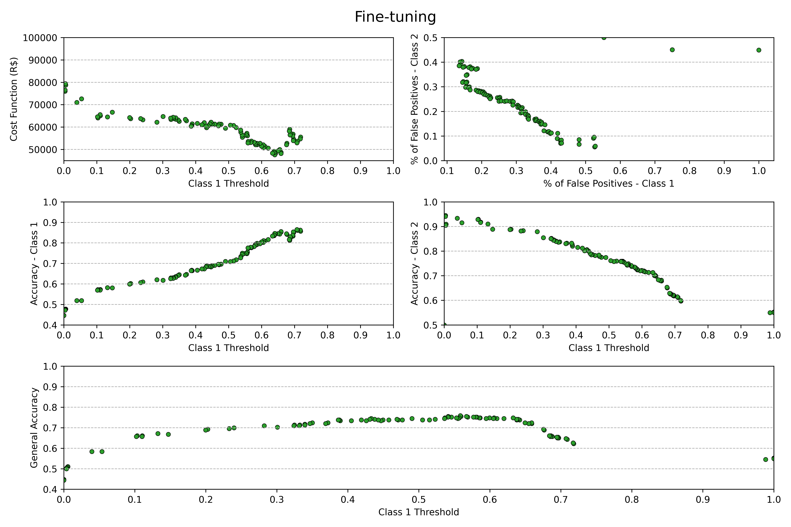

<details open>

<summary><i>Overview of the project</i></summary>

<h2><b>
    Overview of the project
</b></h2>

The project aims to classify correctly the quality of wines based on some of its chemical features. For that, I tested four different classification algorithms with slightly different characteristics: 
1. <b>Logistic Regression:</b> (# talk about some of its charracteristics); 
2. <b>Linear Discriminant Analysis:</b> which assumes that the variables are described by a gaussian distribution and has the same variance;
3. <b>Quadratic Discriminant Analysis:</b> which also assumes a gaussian distribution but not the same covariance matrix, what gives a quadratic decision boundary for the classification;
4. <b>Gaussian Naive Bayes:</b> (# talk about its characteristics).

Choosing the best performant algorithm, where the process is described on the following sections, I was able to achive ## % of accuracy, depending on the bussiness strategy, as described on the section ## (ref to the bussiness strategy section).

</details>

<details open>

<summary><i>Connecting to SQL Server DataBase and Data Manipulation</i></summary>

<h2><b>
    Connecting to SQL Server DataBase and Data Manipulation
</b></h2>

With the wine database mounted on SQL Server, we can use the <i>mysql</i> library to connect Python with it and get the chemichal features table:
```python
connection = connector.connect(
  host = '127.0.0.1',
  user = 'Leonardo-Loreti',
  password = '########',
  database = 'WineQT')

query = 'SELECT * FROM WineData'

wine = pd.read_sql(query, con = connection)
```

There were no <b>null</b> or <b>duplicated</b> data in the dataFrame, as was checked with the <i>.info()</i> and <i>.duplicated().sum()</i> commands, but the data is highly imbalanced as can be seen with the following histogram.

<p align = 'center'>
    
</p>

<p>This leads to serious overfitting to the classes that has more data.</p>

<p>In addition, some features showed a high <b>binary correlation</b>, which can be observed in the matrix correlation graph using <b>Pearson's correlation</b>, and some of them also showed a high <b>Variance Inflation Factor</b> (VIF), which indicates <b>multicollinearity</b> that can affect the accuracy of the coefficient estimates and degrade the inferential power of the models.</p>

<table align = 'center'>
<tr>
<th>VIF (desc. order)</th>
<th>Heatmap</th>
</tr>
<tr>
<td>
<pre>
    - constant: 1.7108e6<br>
    - fixed acidity: 7.7845<br>
    - density: 6.5979<br>
    - alcohol: 3.4108<br>
    - pH: 3.4034<br>
    - citric acid: 3.2245<br>
    - total sulfur dioxide: 2.1243<br>
    - free sulfur dioxide: 1.9075<br>
    - volatile acidity: 1.8799<br>
    - residual sugar: 1.7441<br>
    - quality: 1.5981<br>
    - chlorides: 1.5545<br>
    - sulphates: 1.4955<br>
</pre>
</td>
<td>
    
</td>
</tr>
</table>

<h3><b>
    Feature Creation and Classes Reclassification
</b></h3>

<p>To solve the problem of the high VIF and binary correlation between the variables <b>fixed acidity</b>, <b>citric acid</b>, <b>density</b>, <b>alcohol</b> and <b>total sulful dioxide</b>, it is possible to create new representative variables:</p>
<ul>
    <li><b>total acidity</b> = fixe acidity + volatile acidity</li>
    <li><b>citric acid percentage</b> = citric acid/total acidity</li>
    <li><b>free sulfur dioxide percentage</b> = free sulfur dioxide/total sulful dioxide</li>
    <li><b>percentage of alcohol density</b> = alcohol/(100*density) (verificar se a divisão por 100 foi feita pq a densidade de alcool ficaria muito alta distoando da escala das outras variáveis)</li>
</ul>

<p>Evaluating the Pearson correlation and VIF we see that the multicolinearity and binary correlation were mitigated, and in fact, the target (quality) is the variable that is most related to the other variables, as we want. Of course, the constant param has the biggest VIF, but hits just indicates us that the quality cannot be explained by a constant value, which is pretty obvious (<i>verifica se é isso mesmo</i>).</p>
<table align = 'center'>
<tr>
<th>VIF (desc. order)</th>
<th>Heatmap</th>
</tr>
<tr>
<td>
    - constant: 163.6875<br>
    - quality: 1.4843<br>
    - percentage of alcohol density: 1.4777<br>
    - citric acid percentage: 1.4178<br>
    - sulphates: 1.3602<br>
    - chlorides: 1.3567<br>
    - total acidity: 1.2413<br>
    - free sulfur dioxide percentage: 1.1391<br>
    - residual sugar: 1.0540<br>
</td>
<td>
    
</td>
</tr>
</table>

And to solve the imbalanced dataset problem, first I tried to group the classes 3, 4 and 5, as a single class of "<i>low quality wines</i>", the class 6 was the "<i>intermediate quality wine</i>", and the classes 7 and 8 were grouped as the "<i>premium quality wines</i>", but this didn't showed good results, because the models overfitted to some of the classes, and the goal was to have a model that peforms good on all the classes. So, the final choice was to group the classes 3, 4 and 5 as a single class of "<i>entrance quality wines</i>", and classes 6, 7 and 8 as the "<i>premium quality wines</i>", and this corrected the classes imbalance as can be seen on the next figure.

<p align = 'center'>
    
</p>

I also checked the scatter plot of the [features with themselves](https://github.com/L-Loreti/Wine-Quality-Classifier/blob/main/figs-results/scatter_plot_withoutTarget_modifiedFeatures.png) to verify if there wasn't any patterns that the Pearson's correlation coefficient wouldn't detect, and the scatter plot of the [features with the target](https://github.com/L-Loreti/Wine-Quality-Classifier/blob/main/figs-results/scatter_plot_withTarget_modifiedFeatures.png) to see if I could get a sense of which feature could explain better the target. Initially, it looks like that the feature "<i>pecentage of alcohol density</i>" is the only one that has a pattern in relation with the target. 

</details>

<details open>

<summary><i>Models Selection</i></summary>

<h2><b>Models Selection</b></h2>

I selected four different classification algorithms with slightly different characteristics to check the best one for our dataset: 
1. <b>Logistic Regression:</b> (# talk about some of its charracteristics); 
2. <b>Linear Discriminant Analysis:</b> which assumes that the variables are described by a gaussian distribution and has the same variance;
3. <b>Quadratic Discriminant Analysis:</b> which also assumes a gaussian distribution but not the same covariance matrix, what gives a quadratic decision boundary for the classification;
4. <b>Gaussian Naive Bayes:</b> (# talk about its characteristics).

<h3>Split Dataset on Training and Testing portions</h3>

To maintain an untouch portion of the data as the test portion, I used the <i>train_test_split</i> function. To ensure reproducibility, I always set a specific seed:
```python
test_size_ = 0.25
xTrain, xTest, yTrain, yTest = train_test_split(x, y, test_size = test_size_, random_state = 42)
```

<h3><b>Forward Feature Selection with Cross-Validation</b></h3>

In order to choose the best algorithm for our dataset, first, I checked which features gave the best results with the <b>SequentialFeatureSelector</b> function of the <b>sklearn</b> library, using the metric <b>accuracy</b> with the <b>cross-validation method</b>, as given by my built-in function [<b>get_best_features(...)</b>](https://github.com/L-Loreti/Wine-Quality-Classifier/blob/main/src/functions.py).

Again, to ensure reproducibility of the results, I settled the <b>KFold generator</b> with a specific seed,
```python
n_folds = 10
kf = KFold(n_splits=n_folds, shuffle=True, random_state = 81)
```
The function loops through the different models, checking which <b>combination of features</b>, from 1 to the hole number of features using the forwared selection, gave the best results. Then, I stored the name of these features on a .txt file for posterior formal training, because the <b>SequentialFeatureSelector</b> doesn't show the predictions itself.

</details>

<details open>

<summary><i>Model's Training</i></summary>

<h2><b>Model's Training</b></h2>

Using the same KFold generator, I [trained](https://github.com/L-Loreti/Wine-Quality-Classifier/blob/main/src/model_training.py) the models with the previously selected features, checking its accuracy on both classes and the general accuracy, as can be seen on the next figure.
<p align = "center">
    
</p>

The cross-validation method allows us to visualize the generalization of the models by the standard deviation of the accuracies. 

Analysing the [accuracies](figs-results/Model_accuracies_different_classes_folds=10.txt) for each class, and the general accuracy, we get the Gaussian Naive Bayes, with four features given [here](figs-results/Best_Features.txt), as the best model of our trial. In fact, we see that both the Gaussian Naive Bayes, and the Linear Discriminant Analysis gives the best overall results, indicating that the data are best described by a gaussian distribution, and the covariance are not too different from each other, because the Quadratic Discriminant Analysis, which assumes that the covariances are different, is the worst performant (<i>check if these informations makes sense</i>).

</details>

<details open>

<summary><i>Model Testing and Fine-Tuning</i></summary>

<h2><b>Model Testing and Fine-Tuning</b></h2>

After choosing the best model on the training/validation dataset, we can [test it](src/model_test.py) on the test dataset. For that, I retrained the model with the correct features and the data training data set. Evaluating its accuracies over the test data set, we have,
<ul>
    <li><b>Class 1 accuracy:</b> 70,5 %</li>
    <li><b>Class 2 accuracy:</b> 76,4 %</li>
    <li><b>General accuracy:</b> 73,8 %</li>
</ul>

And we can save the trained model for further improvement, with the library <i>pickle</i>.

```python
    file_model = open('Trained model.pkl', 'wb')
    pickle.dump(model, file_model)
```

<h3><b>Fine-Tuning with Bussiness Knowledge</b></h3>

The model is optimized for the general case where the client buys a balanced amount of wines of class 1 and class 2, but there are some relevant parameters we can include to improve the perfomance of the model for each type of client: the price of the wines of different classes (or the average of the prices), and the amount of buying of each class of wine for a specific group of clients. Our main goal is to reduce the false positives, supposing that every misclassified wine will become refund, or credit for posterior transactions.

<h3><b>Bussiness Case</b></h3>

Let's suppose that there is a group of clients with similar buying behaviour that buys 3000 wines of class 1, and 1000 wines of class 2, in one month. On average, each wine of class 1 costs R$ 45,00, and each wine of class 2 costs R$ 90,00, so the revenue equals <b>R$ 225.000,00</b>. With the original algorithm, a wine will be classified as class 1 if its predicted probability is greater then 50%, that is, the threshold is 50%. We can evaluate an optimized threshold to minimize the cost function:
<p align = 'center'>
$$C = fp_{1} \cdot q_{1} \cdot p_{1} + fp_{2} \cdot q_{2} \cdot p_{2}$$
</p>
where $fp_{i}$ is the false positive rates for the ith class, $q_{i}$ is the quantity of bottle wines bought of this class, and $p_{i}$ the average of its prices.

The <b>ROC curve</b> provides us with the thresholds for class 1 that changes the percentage of false positives for this class.

<p align = 'center'>
    
</p>

With these thresholds, we can calculate the <b>cost function</b> (<i>top-left graph</i>), visualize the <b>relation between the false positives of class 1 and 2</b> (<i>top-right</i>), the <b>accuracy of both classes</b> (<i>middle-left</i> and <i>middle-right</i>, respectively), and the <b>general accuracy for this group of companies</b> (<i>bottom</i>).

<p align = 'center'>
    
</p>

Optimizing the cost function, we get the following results:
<ul>
    <li><b>Minimum of the cost function:</b> R$ 47.596,15, which represents 21,1 % of the amount of sales</li>
    <li><b>Accuracy of class 1:</b> 84,6 %</li>
    <li><b>Accuracy of class 2:</b> 70,2 %</li>
    <li><b>General accuracy:</b> 74,1 %</li>
</ul>

</details>

<details open>

<summary>Next Steps</summary>

<h2><b>Next Steps</b></h2>

With bussiness knowledge it is possible to optimize even further the algorithm, for example: 

<ol>
    <li>If it is possible to aglomerate buyers on specific groups, we can choose a threshold that provides them the best service possible;</li>
    <li>Talking with stakeholders and the bussiness inteligence team, it is possible to decide to optimize another parameter, the <b>general accuracy</b> for example, and this is easily done on my code;</li>
    <li>To improve the algorithm's resolution, that is, to be able to classify wines in all their categories, we need more data to eliminate the imbalance in the database. This is an essential step in providing a more accurate service.</li>
</ol>

</details>
